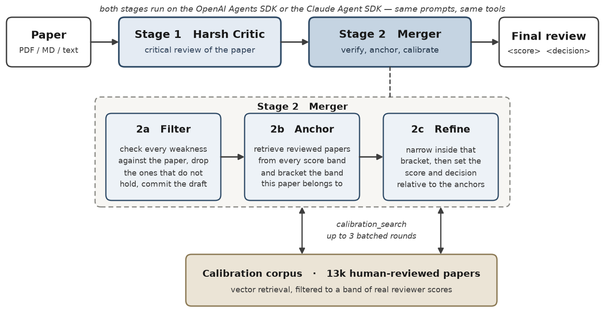
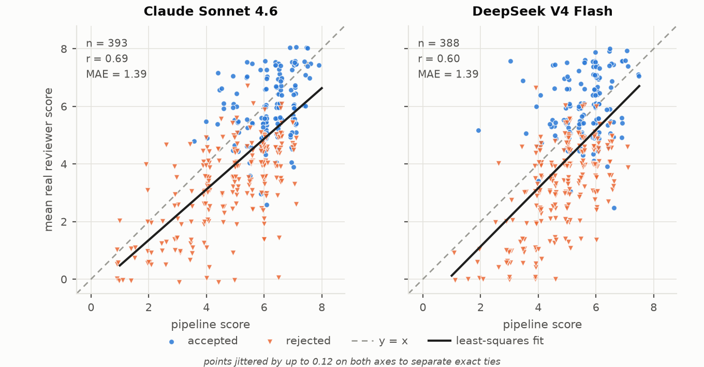
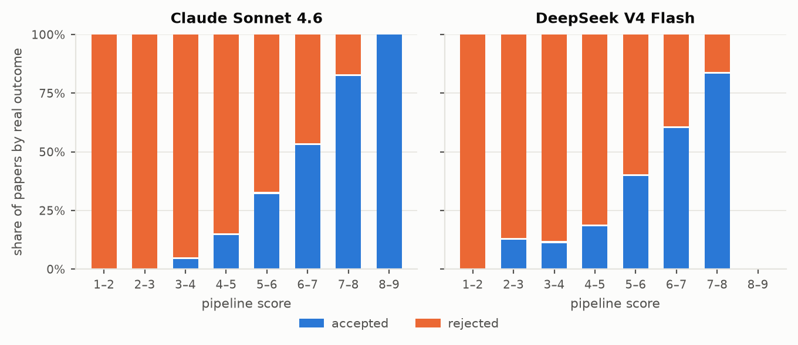

# ARD-Review

An agentic paper reviewer. Give it a paper (PDF, Markdown or plain text) and it
produces a full peer review plus a numeric score that is calibrated against real
human reviews.

This repository is the **minimal software release**: the working pipeline and
nothing else. The experiment harness, baselines, ablations, judge setups and the
paper datasets are not here — the complete research repository will be released
separately, later.

---

## How it works



The pipeline is two agent stages. Neither stage ever receives the paper inline;
both read it from disk through a sandboxed `read_file` / `grep_file` tool pair,
so a long paper is consumed and reasoned about incrementally instead of dumped
into one context window.

**Stage 1 — Harsh Critic** (`prompts/harsh_critic.md`)
Reads the paper in sequential chunks. After every chunk it stops and reasons
about what that part of the paper claims and whether the evidence holds, building
its assessment as it goes. Output is a deliberately critical review.

**Stage 2 — Merger** (`prompts/merger.md`)
Takes the critic's review and cross-checks every single weakness against the
actual paper text before keeping it, dropping the ones that do not survive
verification. It then calibrates the score by *comparison*, not by intuition:

- `draft_review` — the merger must commit its post-filtering draft before it is
  allowed to look at any anchor, so retrieval cannot rationalise a score it
  already decided on.
- `calibration_search` — iterative RAG over a corpus of ~13k real human-reviewed
  papers. Round 1 brackets the plausible score band by retrieving anchors from
  each band (strong reject through strong accept); rounds 2-3 narrow inside that
  bracket. At most 3 batched calls per review.
- Anchors are then read in full with `read_file` and compared against the paper
  under review.

The final review carries `<score>` and `<decision>` tags, which the pipeline
parses out.

Both stages run on either backend:

| Backend | Selected by | Uses |
| --- | --- | --- |
| OpenAI Agents SDK | any plain model id | `OpenAIResponsesModel` against any OpenAI-compatible endpoint (default OpenRouter) |
| Claude Agent SDK | model id prefixed `claude_sdk:` | `ClaudeSDKClient` with the tools exposed as an in-process MCP server |

The two backends see the same prompts and the same tools; only the runtime
differs.

---

## Install

```bash
git clone https://github.com/weathon/ARD-Review.git
cd ARD-Review
pip install -r requirements.txt
cp .env.example .env    # then fill it in
```

Nothing in the pipeline has a silent default for model choice, reasoning effort
or endpoint: a missing environment variable is a hard error, so a run can never
quietly become a different run than the one you asked for. See `.env.example`
for every variable.

For the Claude backend, either put an Anthropic key in `ANTHROPIC_API_KEY` or
leave it empty to use an authenticated Claude subscription.

### Calibration corpus

The calibration RAG needs a corpus of human-reviewed papers. No dataset is
shipped in this repository; build it from the public
[DeepReview-13K](https://huggingface.co/datasets/WestlakeNLP/DeepReview-13K)
dataset:

```bash
python code/download_calibration_corpus.py
```

This writes `datasets/deepreview_13k_calibration/<paper_id>.md` (about 13k files,
around 220 MB). The matching embedding matrix and per-paper average-score index
are downloaded automatically from
[weathon/paper_embeddings](https://huggingface.co/datasets/weathon/paper_embeddings)
the first time they are needed — no embedding calls and no cost on your side.

The corpus file format is load-bearing: the published embeddings were computed
from exactly these files, so do not reformat or rename them.

To run without the corpus at all, pass `--no_cal`; the merger then loses
`calibration_search` and scores on the paper's merits alone. This is a different
method, not a cheaper version of the same one, and the shipped reference runs do
not apply to it.

---

## Usage

```bash
./run_claude.sh  /abs/path/to/paper.pdf     # both stages on Claude Agent SDK
./run_openai.sh  /abs/path/to/paper.pdf     # both stages on OpenAI Agents SDK
```

Or directly:

```bash
HARSH_MODEL="claude_sdk:claude-sonnet-4-6" \
MERGER_MODEL="claude_sdk:claude-sonnet-4-6" \
REASONING_EFFORT="max" \
EXTRACTOR_MODEL="deepseek/deepseek-v4-flash" \
python code/main.py --single_paper paper.pdf
```

Flags:

| Flag | Effect |
| --- | --- |
| `--single_paper PATH` | the paper to review (`.pdf`, `.md`, `.txt`) |
| `--no_cal` | drop `calibration_search`; score on paper merits alone |
| `--skip_calibration` | do not map the raw score onto the reference runs |

PDFs are converted to Markdown first via the Datalab API (needs
`DATALAB_API_KEY`); the converted `.md` is written next to the PDF. References
and appendix are dropped by the converter, and the prompts tell both agents to
treat parser artifacts as parser problems rather than paper flaws.

Outputs:

- `results/reviews/<paper>_review_<timestamp>.md` — the review, its score, and
  the calibration read-out
- `results/pipeline.log` — per-run token usage, cost, both stages' raw outputs

---

## Score calibration

A raw score from a language model means little on its own. This release ships two
reference runs of this exact pipeline over ICLR 2026 submissions whose real
reviewer scores and decisions are known, and every review is reported against
them:

| File | Backend | n |
| --- | --- | --- |
| `results/claude.csv` | Claude Sonnet 4.6, Claude Agent SDK | 393 |
| `results/deepseek.csv` | DeepSeek V4 Flash over OpenRouter, OpenAI Agents SDK | 388 |



Every point is one submission: the pipeline's score against the mean of that
paper's real reviewer scores, coloured by the real accept/reject outcome.



The same runs binned by pipeline score, each column normalised: the share of
papers in that bin that were really accepted and really rejected.

The set is chosen automatically from the merger backend you are running
(`claude_sdk:` maps to `claude.csv`, anything else to `deepseek.csv`), and the
pipeline reports three things:

- **Percentile** — where the score sits in that run's own score distribution.
- **Calibrated score** — ordinary least squares fit of pipeline score onto the
  mean real reviewer score, applied to your score, reported with the fit's
  Pearson r, R-squared and residual MAE.
- **Empirical acceptance rate** — the fraction of reference papers at that exact
  score, and within a 0.5 window of it, that were actually accepted.

Fits over the shipped reference runs:

| Reference run | n | OLS fit | Pearson r | R-squared | Spearman | MAE raw | MAE calibrated | Decision accuracy |
| --- | --- | --- | --- | --- | --- | --- | --- | --- |
| `claude.csv` | 393 | `gt = 0.879 x pred - 0.402` | 0.692 | 0.479 | 0.635 | 1.39 | 1.04 | 70.2% |
| `deepseek.csv` | 388 | `gt = 1.013 x pred - 0.890` | 0.596 | 0.355 | 0.528 | 1.39 | 1.21 | 67.3% |

Scores are on the reviewer scale of the submissions in the set;
`gt_avg_score` is the mean of that paper's real reviewer scores and `gt_binary`
its real accept/reject outcome. Base accept rate is 40.7% and 39.9%
respectively, so decision accuracy is measured against a majority-class baseline
of about 60%.

The CSVs hold predictions and public outcomes only. No paper text, no human
review text, no dataset.

---

## Layout

```
code/main.py                          two-stage pipeline, CLI, score calibration
code/tools.py                         sandboxed file tools + calibration RAG index
code/claude_merger.py                 Claude Agent SDK backend (tools over MCP)
code/paths.py                         path resolution, HuggingFace asset fetch
code/download_calibration_corpus.py   builds the calibration corpus
prompts/harsh_critic.md               stage 1
prompts/merger.md                     stage 2
prompts/cal_with.md                   calibration protocol injected into stage 2
prompts/cal_without.md                its --no_cal replacement
prompts/timeline.md                   current-date grounding for both stages
results/claude.csv                    reference run, Claude backend
results/deepseek.csv                  reference run, OpenAI Agents SDK backend
figures/pipeline.py                   source of the pipeline figure (+ .pdf / .png)
figures/calibration_scatter.py        source of the scatter above (+ .pdf / .png)
figures/accept_rate_bars.py           source of the stacked bars above (+ .pdf / .png)
```

Each figure script writes a PDF (for LaTeX) and a PNG (for this page) from the
same source; run them with `python figures/<name>.py`. The pipeline script also
warns if any label no longer fits its box.

---

## Notes

- Reviewing one paper is a handful of long-context agent turns per stage. Cost is
  dominated by the models you point it at; the Claude SDK path prints its exact
  cost per run.
- The pipeline fails loudly. If a stage returns nothing, if the corpus is
  missing, or if a required variable is unset, it raises rather than substituting
  something else and reporting a number that looks fine.
- The one exception is score extraction: if the merger's own `<score>` /
  `<decision>` tags cannot be parsed, `EXTRACTOR_MODEL` is asked to pull them out
  of the review text, and is instructed to return a sentinel rather than guess.

## Citation

The paper and the full research repository are not yet public. Please check back.
